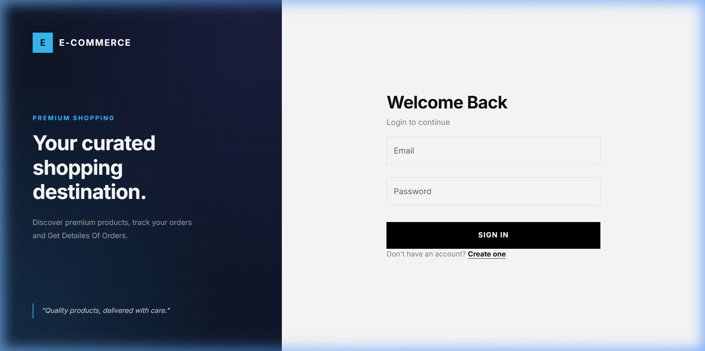
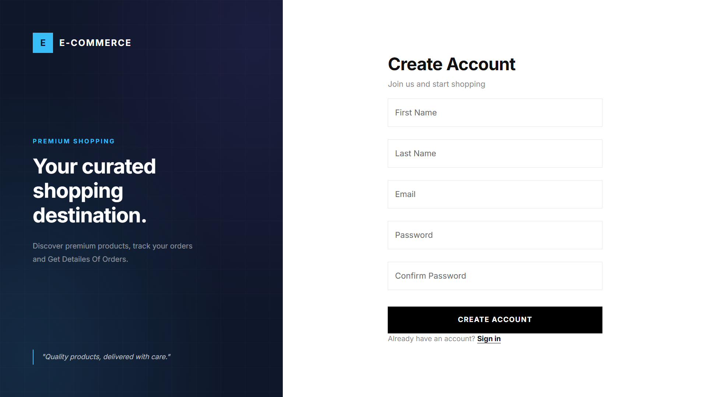
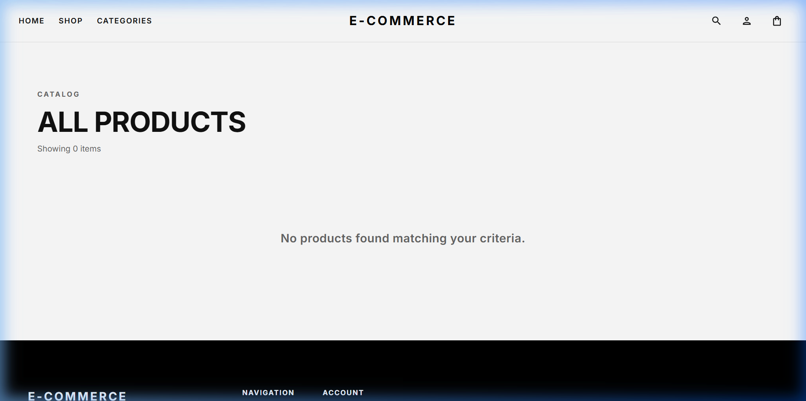
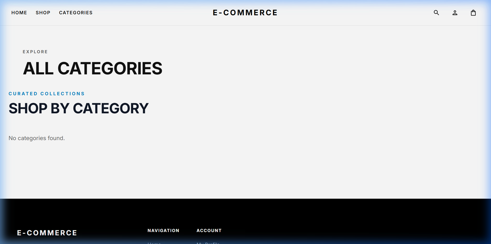
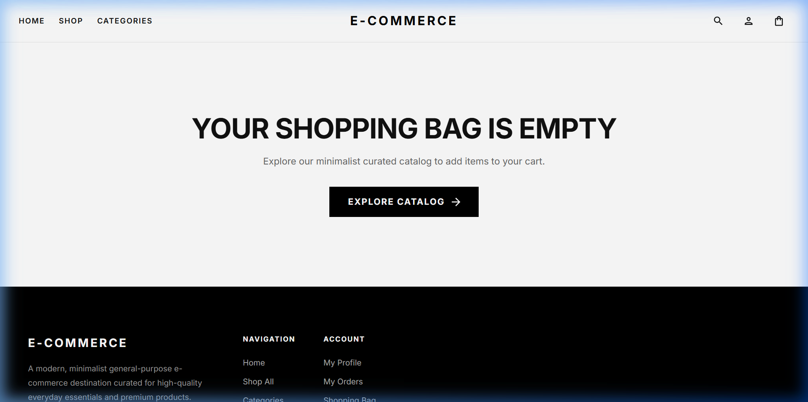
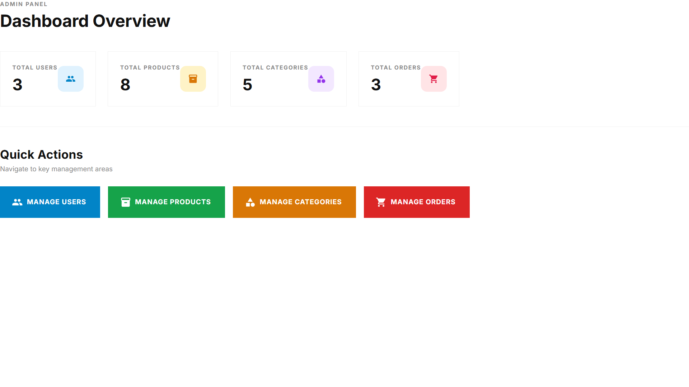

# 🛒 E-Commerce Platform

A full-stack E-Commerce web application built with **React + Vite** on the frontend and **Node.js + Express** on the backend. It features product browsing, category filtering, a shopping cart, wishlist, user authentication, order management, payment processing via **Stripe**, image uploads via **Cloudinary**, caching via **Redis**, and email notifications via **Brevo**.

---

## 📸 Screenshots

### 🏠 Home Page


---

### 🔐 Login Page


---

### 📝 Register Page


---

### 🛍️ Products / Shop Page


---

### 📂 Categories Page


---

### 🛒 Cart Page


---

###  Admin Page


---

### Seller Page


## 🚀 Features

### 🧑‍💻 User Features
- **Authentication** – Register, Login, Logout with JWT (stored in HttpOnly cookies)
- **Product Browsing** – Browse products with filters, sorting, and pagination
- **Category Navigation** – Explore products by categories
- **Shopping Cart** – Add, remove, and update product quantities
- **Wishlist** – Save favourite products
- **Product Reviews** – Leave star ratings and written reviews
- **Checkout & Payment** – Secure checkout powered by **Stripe**
- **Order Management** – View order history and track order status
- **User Profile** – Update personal info and manage addresses
- **Session Management** – Auto-logout on session expiry

### 🔧 Admin Features
- Manage products, categories, and orders via admin routes
- View and update order statuses

### ⚙️ Technical Features
- **Rate Limiting** – Global API rate limiter to prevent abuse
- **Caching** – Redis-powered caching for fast data retrieval
- **Image Uploads** – Cloudinary integration for product images
- **Email Notifications** – Transactional emails via Brevo (Sendinblue)
- **Security** – Helmet, CORS, bcrypt password hashing
- **Compression** – Response compression for better performance
- **Logging** – Morgan HTTP request logger
- **Input Validation** – Joi schema validation on all API inputs
- **Automated Tests** – Jest + Supertest for backend testing

---

## 🏗️ Tech Stack

### Frontend
| Technology | Purpose |
|---|---|
| [React 19](https://react.dev/) | UI Library |
| [Vite](https://vitejs.dev/) | Build Tool & Dev Server |
| [Material UI (MUI)](https://mui.com/) | Component Library |
| [Redux Toolkit](https://redux-toolkit.js.org/) | State Management |
| [Redux Persist](https://github.com/rt2zz/redux-persist) | Persist Redux State |
| [React Router DOM v7](https://reactrouter.com/) | Client-Side Routing |
| [React Hook Form](https://react-hook-form.com/) | Form Handling |
| [Yup](https://github.com/jquense/yup) | Schema Validation |
| [Axios](https://axios-http.com/) | HTTP Client |
| [React Hot Toast](https://react-hot-toast.com/) | Notifications |

### Backend
| Technology | Purpose |
|---|---|
| [Node.js](https://nodejs.org/) | Runtime |
| [Express 5](https://expressjs.com/) | Web Framework |
| [MongoDB + Mongoose](https://mongoosejs.com/) | Database & ODM |
| [Redis (ioredis)](https://github.com/redis/ioredis) | Caching Layer |
| [Stripe](https://stripe.com/) | Payment Processing |
| [Cloudinary](https://cloudinary.com/) | Image Storage & CDN |
| [Brevo](https://www.brevo.com/) | Email Service |
| [JWT](https://jwt.io/) | Authentication Tokens |
| [bcrypt](https://github.com/kelektiv/node.bcrypt.js) | Password Hashing |
| [Joi](https://joi.dev/) | Input Validation |
| [Helmet](https://helmetjs.github.io/) | Security Headers |
| [Multer](https://github.com/expressjs/multer) | File Upload Middleware |
| [Jest](https://jestjs.io/) | Testing Framework |

---

## 📁 Project Structure

```
E-Commerce/
├── backend/
│   ├── config/           # Environment & DB configuration
│   ├── controllers/      # Route handlers / business logic
│   ├── middleware/       # Auth, error, rate-limit middleware
│   ├── models/           # Mongoose schemas
│   ├── routes/           # Express routes
│   │   ├── auth.routes.js
│   │   ├── product.routes.js
│   │   ├── category.routes.js
│   │   ├── cart.routes.js
│   │   ├── order.routes.js
│   │   ├── payment.routes.js
│   │   ├── review.routes.js
│   │   ├── wishlist.routes.js
│   │   ├── address.routes.js
│   │   ├── user.routes.js
│   │   └── admin.routes.js
│   ├── services/         # Business services (payment, email, etc.)
│   ├── utils/            # Helpers & utilities
│   ├── validators/       # Joi validation schemas
│   ├── __tests__/        # Jest test suites
│   ├── app.js            # Express app setup
│   └── server.js         # Server entry point
│
└── frontend/
    ├── src/
    │   ├── api/          # Axios API instances
    │   ├── components/   # Reusable UI components
    │   ├── layouts/      # Page layout wrappers
    │   ├── pages/        # Route-level page components
    │   │   ├── home/
    │   │   ├── auth/
    │   │   ├── products/
    │   │   ├── categories/
    │   │   ├── cart/
    │   │   ├── checkout/
    │   │   ├── orders/
    │   │   ├── profile/
    │   │   ├── admin/
    │   │   └── seller/
    │   ├── routes/       # React Router configuration
    │   ├── services/     # API service functions
    │   ├── store/        # Redux store & slices
    │   ├── theme/        # MUI theme configuration
    │   ├── utils/        # Helper utilities
    │   └── validations/  # Yup validation schemas
    └── index.html
```

---

## 🔌 API Endpoints

| Method | Endpoint | Description |
|--------|----------|-------------|
| `POST` | `/api/v1/auth/register` | Register a new user |
| `POST` | `/api/v1/auth/login` | Login user |
| `POST` | `/api/v1/auth/logout` | Logout user |
| `GET` | `/api/v1/products` | Get all products (with filters) |
| `GET` | `/api/v1/products/:id` | Get single product |
| `GET` | `/api/v1/categories` | Get all categories |
| `GET/POST` | `/api/v1/cart` | Get or update cart |
| `GET/POST` | `/api/v1/wishlist` | Get or update wishlist |
| `GET/POST` | `/api/v1/orders` | Get or place orders |
| `POST` | `/api/v1/payment/create-session` | Create Stripe payment session |
| `POST` | `/api/v1/reviews` | Post a product review |
| `GET/POST` | `/api/v1/address` | Manage user addresses |
| `GET` | `/api/health` | Health check endpoint |

---

## ⚙️ Getting Started

### Prerequisites
- **Node.js** >= 18.x
- **MongoDB** (local or Atlas)
- **Redis** (local or cloud)
- Stripe, Cloudinary, and Brevo accounts

### 1. Clone the repository

```bash
git clone https://github.com/your-username/ecommerce.git
cd E-Commerce
```

### 2. Setup the Backend

```bash
cd backend
npm install
```

Create a `.env` file in `backend/`:

```env
PORT=5000
MONGO_URI=your_mongodb_connection_string
JWT_SECRET=your_jwt_secret
JWT_EXPIRES_IN=7d
CLIENT_URL=http://localhost:5173

# Redis
REDIS_URL=your_redis_url

# Cloudinary
CLOUDINARY_CLOUD_NAME=your_cloud_name
CLOUDINARY_API_KEY=your_api_key
CLOUDINARY_API_SECRET=your_api_secret

# Stripe
STRIPE_SECRET_KEY=your_stripe_secret_key
STRIPE_WEBHOOK_SECRET=your_stripe_webhook_secret

# Brevo (Email)
BREVO_API_KEY=your_brevo_api_key
BREVO_SENDER_EMAIL=your_sender_email
```

Start the backend server:

```bash
npm run dev
```

### 3. Setup the Frontend

```bash
cd ../frontend
npm install
```

Create a `.env` file in `frontend/`:

```env
VITE_API_URL=http://localhost:5000
```

Start the frontend dev server:

```bash
npm run dev
```

### 4. Open the App

Visit [http://localhost:5173](http://localhost:5173) in your browser.

---

## 🧪 Running Tests

```bash
cd backend
npm test
```

Tests are powered by **Jest** and **Supertest**.

---

## 🚢 Deployment

- **Frontend** is deployed on [Vercel](https://vercel.com/) — configured via `frontend/vercel.json`
- **Backend** can be deployed on any Node.js host (Railway, Render, Heroku, etc.)

---

## 🤝 Contributing

1. Fork the repository
2. Create your feature branch (`git checkout -b feature/AmazingFeature`)
3. Commit your changes (`git commit -m 'Add some AmazingFeature'`)
4. Push to the branch (`git push origin feature/AmazingFeature`)
5. Open a Pull Request

---

## 📄 License

This project is licensed under the **ISC License**.

---


